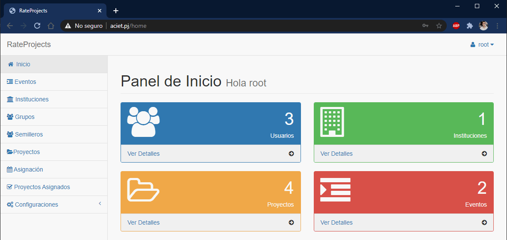
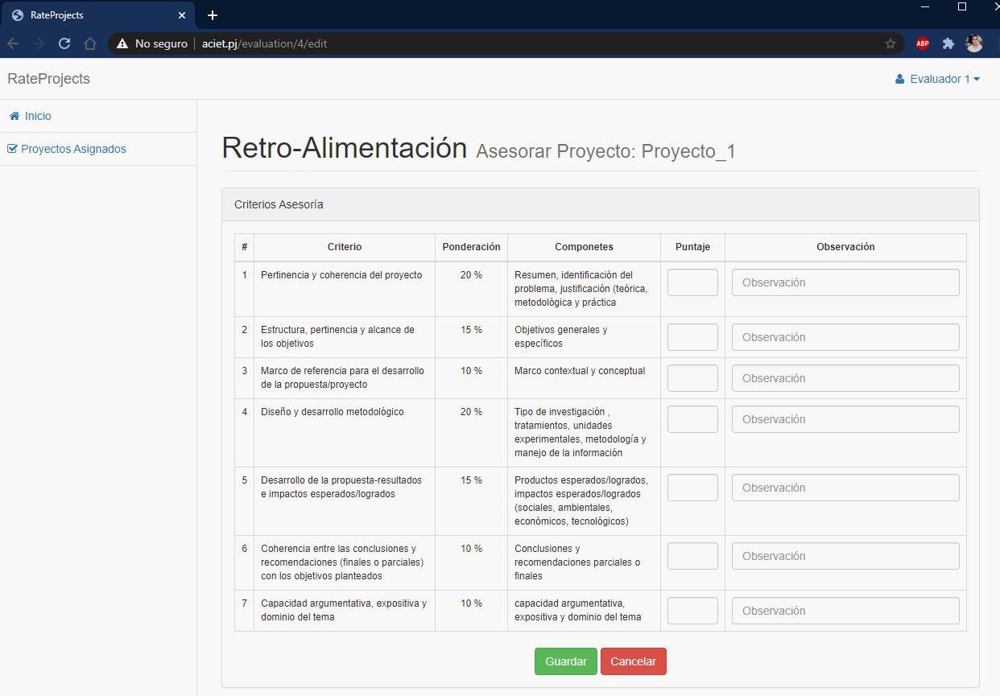

## RateProjects

Esta es una aplicación desarrollada usando Laravel 5.5. La aplicación permite crear, gestionar y calificar proyectos de semilleros y grupos de investigación 
de instituciones educativas, dentro de un marco de concurso o evento institucional.

La plataforma permite crear eventos con fecha de inicio y fin, creación de intituciones educativas, semilleros y grupos asociados a dichas instituciones e ingreso de proyectos, 
para la participación en los eventos (concursos).

El sistema también permite crear usuarios de tipo administrador, coordinador, delegado y evaluador, el usuario administrador es el que tiene total control de la aplicación, y 
puede crear los eventos e instituciones, los usuarios coordinador y delegado son los encargados de registrar los semilleros y grupos y los respectivos proyectos, el usuario evaluador,
es el encargado de calificar los proyectos que se le asignen de acurdo a la rubrica del evento.

 
Después de clonar y ubicarse dentro del proyecto Ejecutar:

- `composer install`
- `cp .env.example .env`

Crear BD y agregar credenciales en el archivo .env

* DB_HOST=localhost
* DB_DATABASE=tu_base_de_datos
* DB_USERNAME=root
* DB_PASSWORD=

- `php artisan key:generate`

Ejecutar Migraciones y sedders (Datos de prueba)

- `php artisan migrate --seed`

